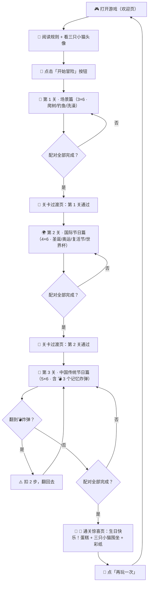

# 产品需求文档 (PRD) · 三只小猫翻牌记忆闯关小游戏

**版本**: v1.0  
**创建日期**: 2026-07-01  
**设计风格**: 童趣糖果治愈系（PlayfulGeometric + Claymorphism + Botanical 三件套组合）

---

## 1. 产品概述

一款以用户朋友的三只真实小猫（毛肚、焦糖、布丁）为卡通原型创作的翻牌记忆闯关小游戏，共 3 关渐进式难度，通过节日主题、冒险场景与"记忆炸弹"机制逐步提升挑战，最终通关后以"生日快乐"彩蛋页面收尾，为朋友献上惊喜感与纪念意义。

- **核心目的**: 制作一个有情感温度的专属纪念小游戏，牌面角色 100% 由用户提供的三只小猫真实形象卡通化而来
- **目标用户**: 用户本人及其朋友（生日礼物属性）
- **产品形态**: 单页 HTML5 网页小游戏（桌面优先，浏览器直接打开即玩，无需构建、无需服务器）

---

## 2. 核心功能

### 2.1 核心角色（三只小猫，由照片/文字描述卡通化）

| 角色名 | 来源 | 外貌描述（卡通化提取特征） | 角色性格（卡通化呈现） |
|--------|------|--------------------------|----------------------|
| **🐱 毛肚 Maodu** | 参考照片 1 | 美短银虎斑 + 白腹；黑色经典虎斑纹；**大而圆的深绿色眼睛**；粉粉的小鼻子；白色肉垫 | 机灵鬼、表情丰富、带点淘气（参考姿势趴着抬头，显得很灵动） |
| **🐱 焦糖 Jiaotang** | 参考照片 2 | 乳白/淡金渐层（全身浅奶金色绒毛，毛尖略深）；**超大超圆的祖母绿眼睛**；圆脸胖嘟嘟；小三角耳朵 | 乖乖牌、端庄文静、坐姿端正（参考姿势正坐，表情认真略带严肃，很乖） |
| **🐱 布丁 Buding** | 无照片 · 文字描述 | **曼康基短腿 + 长毛**；毛色：淡橘色（橘白相间，整体偏浅，奶油橘调）；**标志性：中分淡橘色额头发型**（脑门上有一条明显的分界线，左右两边橘色毛对称）；短腿小肉垫明显 | 呆萌、傻萌、走路一摇一摆、因为短腿常常跳不上沙发但很努力 |

> 🎯 卡通化风格统一要求：Q版 2D 水彩+扁平卡通风，大头大眼，四肢简化，糖果色马卡龙配色，毛绒质感柔软可爱，和整体游戏 UI 风格一致

### 2.2 功能模块

1. **开始欢迎页**：游戏规则介绍 + 三只小猫圆形头像卡 + 游戏名 Logo + 「开始冒险」按钮
2. **关卡 1（场景篇 · 3×6 = 18 张）**：爬树 / 钓鱼 / 洗澡 三种场景 × 三只小猫
3. **关卡 2（国际节日篇 · 4×6 = 24 张）**：圣诞节 / 奥运会 / 复活节 / 世界杯 四种主题 × 三只小猫
4. **关卡 3（中国传统节日篇 · 5×6 = 30 张，含记忆炸弹）**：春节 / 端午 / 中秋 / 冬至 × 三只小猫 + **3 个记忆炸弹（💣 翻开要扣时间/次数）**
5. **通关惊喜页**：「生日快乐！」大标题 + 3D 生日蛋糕动效 + 三只小猫围坐在蛋糕旁的插画 + 庆祝彩纸飘落动画

### 2.3 页面详情

| 页面名称 | 模块名称 | 功能描述 |
|----------|----------|----------|
| **欢迎页 / Home** | 规则说明区 | 4 条规则大字展示：① 点击两张牌翻面；② 图案相同配对成功；③ 不同则翻回去；④ 第三关 💣 炸弹要避开，翻到会减少步数 |
| | 三只小猫角色卡 | 圆形头像 + 角色名 + 一句性格介绍（毛肚「淘气大王」/ 焦糖「乖乖小公主」/ 布丁「呆萌短腿橘」） |
| | 开始按钮区 | 大圆角弹性按钮「🎂 开始冒险，送给你！」，悬停放大 1.05 倍 + 弹性缓动 |
| **关卡页 / Game（3 个关卡共用）** | 顶部状态栏 | 左：关卡标题「第 X 关 · 主题名」；中：剩余步数/时间；右：已配对数 / 总对数 |
| | 牌面网格区 | 根据关卡不同排列不同行列数：1关 3×6 / 2关 4×6 / 3关 5×6；每块牌用 Claymorphism 黏土质感，悬停弹起 + 阴影变化 |
| | 返回/重置按钮 | 左下角小按钮：← 回欢迎页 · 🔄 重来本关 |
| **关卡过渡页 / Transition** | 祝贺区 | 🎉「第 X 关通过！」大字 + 当前关卡完成步数统计 + 下一关主题预告 |
| | 进入下一关按钮 | 「➡️ 进入下一关」 |
| **通关惊喜页 / Finale** | 生日快乐标题区 | 「🎂 生日快乐！」超大艺术字 + 渐变发光描边 + 彩纸飘落动画 |
| | 蛋糕展示区 | 3 层生日蛋糕（蜡烛闪烁），周围三只小猫围坐（毛肚在左爬蛋糕 / 焦糖端坐右 / 布丁垫着脚够蛋糕最上层，短腿够不着的呆萌感） |
| | 祝福语区 | 「愿三只小猫永远陪着你 · 岁岁年年 🐾」 |
| | 重玩按钮 | 「🔁 再玩一次」→ 回到欢迎页 |

---

## 3. 核心流程

### 用户主流程（自然语言描述）

用户打开游戏 → 看到欢迎页：标题 + 三只小猫头像 + 游戏规则 → 点击「开始冒险」按钮 → 进入第 1 关（场景篇 · 3×6 共 18 张牌 = 9 对）→ 点击两张牌翻面，配对成功保持打开，错误则 800ms 后翻回 → 全部配对完毕后弹出关卡过渡页「第 1 关通过！」→ 点击进入第 2 关（国际节日篇 · 4×6 = 24 张 = 12 对）→ 同样机制通关 → 进入第 3 关（中国传统节日篇 · 5×6 = 30 张 = 15 对，其中 3 张是「💣 记忆炸弹」）→ 翻到炸弹牌时扣除 2 点步数 + 震动反馈 + 弹提示「哎呀！踩到炸弹啦～」→ 全部配对成功（或在限定步数内完成）→ 通关惊喜页：生日快乐大标题 + 3 层蛋糕 + 三只小猫围坐插画 + 彩纸飘落动画 → 点击「再玩一次」回到欢迎页。

### Mermaid 流程图

---

## 4. 用户界面设计

### 4.1 设计风格（糖果治愈系 · 固化组合）

基于 LRN-20260630-002 固化的 PlayfulGeometric + Claymorphism + Botanical 三件套：

| 设计 Token | 具体值 |
|-----------|--------|
| **背景色** | `#FFF8F0`（奶油白，带极淡的磨砂颗粒噪点纹理） |
| **主色 Primary** | `#FF8FB1`（粉红糖果，用于按钮主色、标题高亮） |
| **辅色 Accent** | `#B5DEFF`（淡天蓝，用于辅助按钮、状态栏背景） |
| **成功色 Success** | `#C7F0BD`（薄荷绿，用于配对成功反馈） |
| **警告色 Warning** | `#FFE29A`（奶黄，用于炸弹警告、关卡过渡） |
| **危险色 Danger** | `#FF6B6B`（樱桃红，用于炸弹翻到扣步数） |
| **文字色 Text** | `#3D405B`（深靛蓝，不刺眼的深色） |
| **圆角规范** | 小按钮 20px / 卡牌 32px / 主按钮 9999px pill 形 / 头像 50% 圆形 |
| **阴影 · 黏土感** | `0 10px 30px -10px rgba(255,143,177,0.45)` 外软阴影 + `inset 2px 2px 5px rgba(255,255,255,0.8), inset -3px -3px 8px rgba(0,0,0,0.05)` 内立体阴影 |
| **字体** | 标题：圆润无衬线 + 粗细对比；正文：系统圆润 PingFang SC / Segoe UI Rounded |
| **动画** | 卡牌翻面：CSS 3D flip `rotateY(180deg)` 400ms `cubic-bezier(0.34, 1.56, 0.64, 1)` 弹性缓动；按钮悬停 `scale(1.05)` 150ms；页面切换 translate 过渡 |

### 4.2 页面设计概览

| 页面名称 | 模块名称 | UI 元素说明 |
|----------|----------|-------------|
| **欢迎页 Home** | 顶部 Logo 区 | 游戏名「🐾 三只小猫翻牌冒险记」艺术字，字母 O 换成爪印图案，主色渐变描边 |
| | 规则卡片 | Claymorphism 质感大卡片，4 条规则用 emoji 图标开头 + 大字号列表 |
| | 三只小猫角色栏 | 横向等距布局，3 个圆形头像（直径 160px + 黏土感双重阴影）+ 下方名字 + 性格标签小徽章 |
| | CTA 主按钮 | 居中大号 Pill 形按钮，主色 #FF8FB1 渐变 → #FFCAD4，白色粗字「🎂 开始冒险，送给你！」，下方小字一行：「为你准备的 3 关闯关，最后有惊喜 👀」 |
| **关卡页 Game** | 顶部状态栏 | 横长条（淡蓝 #B5DEFF 背景圆角 20px），3 列等分：左「第 1 关 · 场景冒险」/ 中「剩余步数：30」/ 右「配对：0 / 9」 |
| | 牌面网格区 | `display: grid` 均匀排列，卡牌 3D 翻转效果，背面：统一糖果色抽象几何图案（PlayfulGeometric：圆点 + 条纹 + 猫爪），正面：每只小猫对应场景/节日的卡通插画 |
| | 底部控制栏 | 左小按钮「← 欢迎页」+ 右小按钮「🔄 重来本关」，均为黏土感圆角小方块 |
| **关卡过渡 Transition** | 过渡卡 | 居中超大淡奶黄卡片，顶部 🎉 emoji 大字动画弹入，中部两行统计：「完成步数：XX / 30」「用时：XX 秒」，底部大按钮「➡️ 下一关等你！」 |
| **通关惊喜页 Finale** | 生日标题 | 屏幕上方 20vh 处「🎂 生日快乐！」7 字，每个字独立大小错落，渐变 `#FF8FB1 → #FFD6A5` 描边发光 |
| | 蛋糕 + 猫咪插画区 | 中间 40vh 主视觉区：3 层蛋糕居中，毛肚左攀蛋糕边缘 / 焦糖右端正坐抬头 / 布丁正前方短腿踮脚够不到顶层草莓（呆萌表情） |
| | 彩纸动画 | CSS 粒子动画，马卡龙 6 色小纸片从屏幕顶部随机飘落、旋转 |
| | 重玩按钮 | 底部居中「🔁 再玩一次，把惊喜再看一遍 😻」 |

### 4.3 响应式

- **优先适配**：桌面端（1280×800 及以上）—— 当前用户仅桌面端
- **卡牌尺寸自适应**：用 `minmax(90px, 1fr)` 保证牌不小于 90px，同时铺满可用宽度
- **触屏**：本次不做手机触屏，但点击区域尺寸仍 ≥ 80px（未来扩展留余量）

### 4.4 非 3D 场景声明

本游戏为 **2D DOM + CSS 动画** 实现，**不使用 WebGL/Three.js 3D 引擎**：
- 蛋糕 3D 效果用纯 CSS 多层 `box-shadow` + 渐变 + `perspective` 伪 3D 实现
- 猫咪牌面全部为 2D 卡通插画图片（或 SVG 数据 URI）
