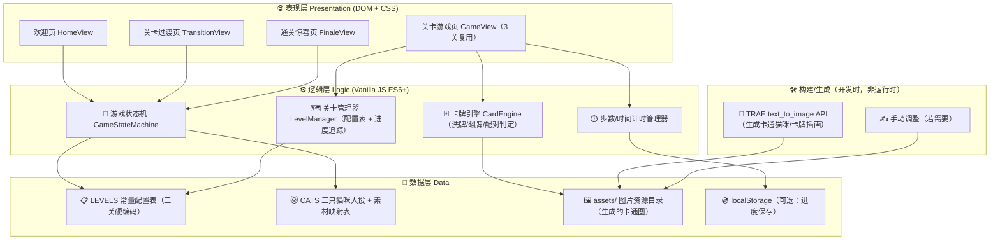

# 技术架构文档 · 三只小猫翻牌记忆闯关小游戏

**版本**: v1.0  
**创建日期**: 2026-07-01  
**技术选型原则**: 高效优先 · 打开即玩 · 零构建步骤 · 无外部服务器依赖

---

## 1. 架构设计（Mermaid 分层图）



---

## 2. 技术选型说明

| 模块 | 选型 | 选型理由（高效优先原则） |
|------|------|------------------------|
| **整体架构** | **纯 HTML + CSS + Vanilla JS（原生 ES6+）** | 零构建、零依赖、单页；浏览器直接双击 `index.html` 即玩；不需要 npm install / vite build 等步骤；游戏体积极小（< 5MB 含全部图片），100% 符合「高效 + 打开即玩」要求 |
| 不选 React/Vite 的原因 | — | 翻牌游戏体量极小（3 关 + 2 静态页），构建工具的收益为负，反而增加启动成本 |
| **CSS 方案** | 原生 CSS（CSS Variables 集中主题 + Grid/Flex 布局） | 糖果治愈系 tokens 全部在 `:root` 变量中定义；卡牌翻转用原生 `transform: rotateY + perspective`，无需动画库 |
| **动画库** | **不使用第三方动画库** | 用 CSS Keyframes + Transition 覆盖全部需求：卡牌翻、按钮弹、彩纸飘落、3 层蛋糕立体效果 |
| **DOM 操作** | 原生 `document.querySelector` + `innerHTML` 模板字符串 | 轻量高效，无需虚拟 DOM |
| **卡牌图片生成** | **TRAE 内置 text_to_image API** | 生成三只小猫的卡通头像（3 张） + 每关每只猫每个主题单独一张卡牌插画（第一关 3×3=9 张 + 第二关 4×3=12 张 + 第三关 4×3=12 张 + 记忆炸弹 1 张） = 共 **37 张**卡通图（正方形 HD，压缩后体积可控） |
| **资源放置** | 本地 `assets/` 目录相对路径引用 | 纯离线，不需要外网 |
| **进度保存（可选）** | `localStorage.setItem('cat-memory-progress')` | 刷新不丢进度，用户可从上次未通关的关卡继续 |

---

## 3. 目录结构（项目中新增内容）

```
TRAE/
├── index.html                           ← 游戏入口（唯一 HTML，内联 CSS 主题变量）
├── styles.css                           ← 全部样式（卡牌/动画/布局）
├── game.js                              ← 全部游戏逻辑（状态机/引擎/配置表）
├── assets/
│   ├── cats/                            ← 三只小猫基础卡通头像（欢迎页用）
│   │   ├── avatar-maodu.png             ← 🐱 毛肚：美短银虎斑+白，大圆绿眼睛，淘气
│   │   ├── avatar-jiaotang.png          ← 🐱 焦糖：乳色渐层，圆脸大眼，端庄
│   │   └── avatar-buding.png            ← 🐱 布丁：曼康基短腿长毛淡橘，中分额头
│   ├── cards/                           ← 卡牌插画（每只猫×每主题一张）
│   │   ├── level1-scene/                ← 第一关 3 场景（爬树/钓鱼/洗澡）
│   │   │   ├── maodu-climb-tree.png
│   │   │   ├── jiaotang-climb-tree.png
│   │   │   ├── buding-climb-tree.png
│   │   │   ├── maodu-fishing.png        … 共 9 张
│   │   │   └── …
│   │   ├── level2-international/        ← 第二关 4 国际主题（圣诞/奥运/复活节/世界杯）
│   │   │   ├── maodu-christmas.png      … 共 12 张
│   │   │   └── …
│   │   └── level3-chinese/              ← 第三关 4 传统节日（春节/端午/中秋/冬至）
│   │       ├── maodu-spring-festival.png … 共 12 张
│   │       └── …
│   ├── special/
│   │   ├── memory-bomb.png              ← 💣 记忆炸弹（糖果风炸弹，带猫爪图案，不吓人）
│   │   ├── cake-finale.png              ← 通关页 3 层蛋糕 + 三只小猫围坐插画（或纯 CSS 实现）
│   │   └── card-back-pattern.svg        ← 卡牌背面统一图案（PlayfulGeometric 几何+猫爪，可 SVG 代码生成）
│   └── confetti/                        ← 若不用纯 CSS 彩纸则放粒子图（本次优先用 CSS Keyframes 动态生成，无需图片）
└── .trae/documents/
    ├── PRD-猫咪翻牌记忆小游戏.md         ← 已生成
    └── TECH-ARCH-猫咪翻牌记忆小游戏.md   ← 本文档
```

---

## 4. 游戏状态机（核心逻辑）

### 4.1 状态定义

```js
const GAME_STATE = {
  HOME: 'home',                    // 欢迎页
  LEVEL_1: 'level_1',              // 第 1 关：场景篇 3×6
  LEVEL_2: 'level_2',              // 第 2 关：国际节日 4×6
  LEVEL_3: 'level_3',              // 第 3 关：传统节日 5×6（含炸弹）
  TRANSITION_1_TO_2: 'trans_1_2',  // 关卡过渡页 1→2
  TRANSITION_2_TO_3: 'trans_2_3',  // 关卡过渡页 2→3
  FINALE: 'finale'                 // 通关惊喜页：生日快乐蛋糕
};
```

### 4.2 状态迁移触发条件

| 当前状态 | 事件 | 目标状态 |
|---------|------|---------|
| HOME | 用户点击「🎂 开始冒险」 | LEVEL_1 |
| LEVEL_1 | matchedPairs === totalPairs (9/9) | TRANSITION_1_TO_2 |
| TRANSITION_1_TO_2 | 用户点击「➡️ 下一关」 | LEVEL_2 |
| LEVEL_2 | matchedPairs === totalPairs (12/12) | TRANSITION_2_TO_3 |
| TRANSITION_2_TO_3 | 用户点击「➡️ 下一关」 | LEVEL_3 |
| LEVEL_3 | matchedPairs === totalPairs (15/15) | FINALE |
| FINALE | 用户点击「🔁 再玩一次」 | HOME |
| 任意 LEVEL_x | 用户点击「🔄 重来本关」 | 重入 LEVEL_x（重置步数/牌） |
| 任意 LEVEL_x | 用户点击「← 欢迎页」 | HOME |

### 4.3 卡牌引擎核心流程（CardEngine）

1. **生成卡牌对**：根据关卡配置 `cardTypes` 数组，每种类型 × 2 张，形成成对数组
2. **Fisher-Yates 洗牌**：标准洗牌算法，保证每次随机
3. **翻牌约束**：
   - 同一时刻最多翻开 2 张未配对牌
   - 第 1 张翻 → 记录 `firstCard`
   - 第 2 张翻 → 比较 `firstCard.type === secondCard.type`
   - ✅ 相同 → 状态 `matched = true`，保持翻开，配对计数 +1
   - ❌ 不同 → 800ms 后自动翻回；若其中 1 张为**炸弹**，额外扣 2 步数 + 震动反馈 + 弹 Toast「哎呀！踩到炸弹啦～」
4. **胜利条件**：`matchedPairs === totalPairs`

---

## 5. 关卡配置表（LEVELS 常量，硬编码在 game.js）

```js
const CATS = [
  { id: 'maodu',     name: '毛肚',   avatarPath: 'assets/cats/avatar-maodu.png',    desc: '淘气大王 虎斑机灵鬼' },
  { id: 'jiaotang',  name: '焦糖',   avatarPath: 'assets/cats/avatar-jiaotang.png', desc: '乖乖小公主 乳色大眼萌' },
  { id: 'buding',    name: '布丁',   avatarPath: 'assets/cats/avatar-buding.png',   desc: '呆萌短腿橘 中分发型' },
];

const THEMES_L1_SCENE = [
  { id: 'climb-tree', name: '爬树',   icon: '🌳' },
  { id: 'fishing',    name: '钓鱼',   icon: '🎣' },
  { id: 'bathing',    name: '洗澡',   icon: '🛁' },
];

const THEMES_L2_INTERNATIONAL = [
  { id: 'christmas',    name: '圣诞节',   icon: '🎄' },
  { id: 'olympics',     name: '奥运会',   icon: '🏅' },
  { id: 'easter',       name: '复活节',   icon: '🐰' },
  { id: 'worldcup',     name: '世界杯',   icon: '⚽' },
];

const THEMES_L3_CHINESE = [
  { id: 'spring-festival',  name: '春节', icon: '🧧' },
  { id: 'dragon-boat',      name: '端午', icon: '🐲' },
  { id: 'mid-autumn',       name: '中秋', icon: '🥮' },
  { id: 'winter-solstice',  name: '冬至', icon: '🥟' },
];

const LEVELS = [
  {
    id: 1,
    name: '场景冒险篇',
    subtitle: '看看三只小猫的日常～',
    rows: 3, cols: 6,       // 3×6 = 18 张 = 9 对
    cats: CATS,
    themes: THEMES_L1_SCENE,
    bombs: 0,
    stepsLimit: 30,         // 宽松：最多 30 步（全错最多 9×2=18 次翻牌，肯定过）
  },
  {
    id: 2,
    name: '国际节日篇',
    subtitle: '环球节日大冒险！',
    rows: 4, cols: 6,       // 4×6 = 24 张 = 12 对
    cats: CATS,
    themes: THEMES_L2_INTERNATIONAL,
    bombs: 0,
    stepsLimit: 40,
  },
  {
    id: 3,
    name: '传统节日篇 · 终极挑战',
    subtitle: '小心记忆炸弹哦！💣',
    rows: 5, cols: 6,       // 5×6 = 30 张 = 15 对
    cats: CATS,
    themes: THEMES_L3_CHINESE,
    bombs: 3,               // 3 个炸弹 pair = 6 张炸弹牌 → 实际 12 cat+theme 对 + 3 bomb 对 = 15 对 ✓
    stepsLimit: 50,         // 50 步（扣炸弹每次 -2，所以大概允许翻错 ≤ 10 次）
  },
];
```

> ✅ 数学一致性校验（每关 2 张/对，偶数）：
> - Level 1：3 猫 × 3 主题 = 9 种 × 2 = **18 张** = 3 × 6 ✓
> - Level 2：3 猫 × 4 主题 = 12 种 × 2 = **24 张** = 4 × 6 ✓
> - Level 3：3 猫 × 4 主题 + 3 炸弹 = 15 种 × 2 = **30 张** = 5 × 6 ✓

---

## 6. 卡牌图片生成规范（text_to_image API）

### 6.1 Prompt 构造模板（统一风格）

**基础风格前缀（每图必加）**：
> "Cute kawaii chibi cartoon cat, pastel candy color palette, soft claymorphism lighting, playful watercolor 2D flat illustration, thick clean outlines, no text no watermark, white background, square composition, hd quality, highly detailed fluffy fur"

**三只小猫差异化特征（加入 Prompt 确保区别）**：

| 猫 | 必须包含的特征词 |
|---|----------------|
| 🐱 **毛肚 Maodu** | `American Shorthair silver tabby cat with white belly and paws, classic black stripes on forehead, big round dark green eyes, pink nose, playful naughty expression, wearing a blue and red plaid harness badge with ribbons` |
| 🐱 **焦糖 Jiaotang** | `British Shorthair golden chinchilla gradient pale cream cat, round face, huge round emerald eyes, serious calm expression, super fluffy fur, sitting upright elegant pose, wearing a blue plaid triangle bandana with a blue rosette badge and red ribbons` |
| 🐱 **布丁 Buding** | `Munchkin cat (short stubby legs), long fluffy pale cream-orange fur, signature center-parted orange bangs hairstyle on forehead, round amber eyes, chubby round face, silly cute confused expression, standing pose showing tiny short legs` |

**场景/节日后缀（追加 Prompt 末尾）**：
示例（毛肚爬树）：`... climbing a tall cherry blossom tree, spring leaves background, excited face gripping a branch`
示例（焦糖圣诞节）：`... christmas theme, wearing a santa hat, surrounded by colorful gift boxes and pine tree with fairy lights, sitting gracefully`
示例（布丁端午节）：`... dragon boat festival theme, sitting on a mini bamboo steamer next to rice dumplings zongzi, holding a small red envelope`

### 6.2 生成参数

- **image_size**: `square_hd`（卡牌正方形最佳）
- **数量**: 37 张 = 3 头像 + (3+4+4)×3 卡牌主题 + 1 炸弹
- **压缩**: PNG 输出，全部图片合计 < 5MB

---

## 7. 性能与兼容性

| 指标 | 要求 | 实现方式 |
|------|------|---------|
| **首屏加载** | ≤ 2s，本地打开 0.5s 内 | 全部资源本地相对路径；CSS 内联关键样式 |
| **卡牌翻转动画帧率** | 60fps | 仅使用 `transform + opacity`，触发 GPU 合成层，不触发 reflow |
| **兼容性** | Chrome 90+ / Edge 90+ / Safari 15+（现代浏览器全覆盖） | 不使用 < ES2017 新特性；Grid/Flex 均降级兼容 |
| **无外网依赖** | 100% 离线可玩 | CDN 为零；图片/字体 100% 本地 assets 目录或系统字体 |
| **移动端** | 本次不做，但 DOM 点击区 ≥ 80px 保证触屏可玩 | 留扩展空间 |

---

## 8. 开发阶段步骤（执行顺序）

1. **Step 0 · 素材生成**：用 text_to_image API 按 §6 规范生成 37 张卡通图，按 §3 目录结构放置（一次性生成，不修改）
2. **Step 1 · 搭建骨架**：创建 `index.html` + `styles.css`（主题 tokens + 布局骨架）+ `game.js`（空文件）
3. **Step 2 · 实现状态机**：HOME / LEVEL / TRANS / FINALE 四个视图切换，纯 DOM 切换 class 控制显示
4. **Step 3 · 实现卡牌引擎**：洗牌 / 翻牌 / 配对检测 / 炸弹扣步 / 步数限制
5. **Step 4 · 接入关卡配置表**：LEVELS[0-2] 循环渲染，行列通过 CSS Grid 自动排列
6. **Step 5 · 视觉润色**：Claymorphism 卡牌阴影、糖果色按钮、翻转动画、彩纸粒子、通关页纯 CSS 3 层蛋糕立体效果
7. **Step 6 · 自检**：三关各通关一遍 + 炸弹 100% 触发 + 步数限制生效 + localStorage 保存进度
